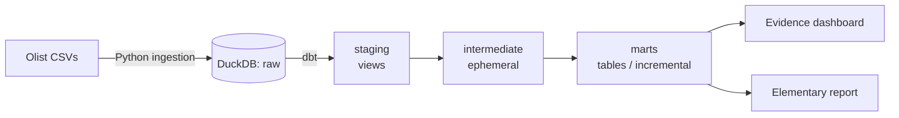

# Brazilian E-Commerce Analytics — Modern Data Stack on DuckDB + dbt

An end-to-end analytics engineering project on the public Olist Brazilian
e-commerce dataset (~99K orders, 2016–2018). Raw CSVs are loaded into DuckDB,
modeled with dbt into a tested star schema, and surfaced through a public
Evidence dashboard and an Elementary data-quality report.

Built as a portfolio piece demonstrating the full analytics engineering
workflow: ingestion → transformation → testing → BI → data observability.

## Live

- **Dashboard:** https://modern-data-stack-ecommerce.vercel.app
- **Data quality report:** https://nikjamnik.github.io/modern-data-stack-ecommerce/elementary_report

## Architecture



## Stack

- **Warehouse:** DuckDB (embedded, file-based)
- **Transformation:** dbt (dbt-duckdb), dbt-utils, dbt-expectations
- **Data quality / observability:** Elementary
- **BI:** Evidence (BI-as-code, deployed on Vercel)
- **Environment:** Python via `uv`, Node.js for Evidence, WSL2 / Ubuntu

## What's Built

- **6 staging models** — type-casting and cleanup of source data (one per source table)
- **3 intermediate models** — orders + payments, identity resolution, enriched order items
- **3 mart models** — star schema:
  - `dim_customers` — customer dimension with simplified RFM segmentation
  - `dim_products` — product dimension with computed sales metrics
  - `fct_orders` — order-level fact (incremental materialization)
- **~180 data tests** — uniqueness, not-null, relationships, accepted values, value ranges
- **Deterministic analytics** — recency calculated against a fixed "as-of date"
  (latest order in data), not `current_date()`, for reproducible results
- **CI** — GitHub Actions runs `dbt deps`, `dbt parse`, and `dbt compile` on every
  pull request and push (slim CI; full test run on sampled seeds is on the roadmap)

## Materialization Strategy

| Layer        | Materialization | Rationale                                              |
|--------------|-----------------|--------------------------------------------------------|
| staging      | view            | Always-fresh, lightweight cleanup; read only at build  |
| intermediate | ephemeral       | CTE-only building blocks, no warehouse footprint        |
| marts (dim)  | table           | Read frequently by BI; periodic full refresh            |
| marts (fact) | incremental     | Append-only events; only new/changed rows processed     |

## Key Findings

- **The overwhelming majority of customers are one-time buyers**, and they drive
  the bulk of total revenue — the platform's central retention problem. Revenue
  depends on constant new-customer acquisition rather than repeat purchases.
- **Average order value is roughly flat across segments** — repeat customers
  don't spend more per order; they simply (rarely) order again.
- **The product catalog has a long tail** — a small number of categories drive
  most revenue, typical of marketplaces.

## Data Setup

This project uses the [Olist Brazilian E-Commerce dataset](https://www.kaggle.com/olistbr/brazilian-ecommerce),
downloaded programmatically via the Kaggle API.

**1. Get Kaggle API credentials.** Log in to Kaggle →
[Account settings](https://www.kaggle.com/settings/account) → **Create New Token**.
This downloads a `kaggle.json` with your username and key.

**2. Provide credentials.** Copy `.env.example` to `.env` and set your values
(`.env` is gitignored and never committed):

```bash
cp .env.example .env
# then edit .env and set KAGGLE_USERNAME and KAGGLE_KEY
```

**3. Download the data.** The script is idempotent — re-running it when files
are already present is a no-op. CSVs are extracted into `data/raw/olist/`.

```bash
python ingestion/download_olist.py
```

## How to Run

Prerequisites: Python (with [`uv`](https://docs.astral.sh/uv/)) and Node.js.
Complete the **Data Setup** above first to download the dataset.

```bash
# 1. Install Python dependencies
uv sync

# 2. Download the dataset (see Data Setup for credentials)
python ingestion/download_olist.py

# 3. Load raw CSVs into DuckDB
python ingestion/load_to_duckdb.py

# 4. Build and test the dbt project
cd dbt_project
dbt deps
dbt build --profiles-dir .

# 5. Run the Evidence dashboard locally
cd ../dashboard
npm install
npm run sources
npm run dev          # http://localhost:3000
```

## Repository Structure

```
.
├── ingestion/          # Python: load raw CSVs into DuckDB
├── dbt_project/        # dbt: staging / intermediate / marts, tests, profiles
│   └── models/
│       ├── staging/
│       ├── intermediate/
│       └── marts/
├── dashboard/          # Evidence BI-as-code project
├── elementary_report/  # Generated data-quality report (HTML)
└── data/               # DuckDB warehouse + raw CSVs (gitignored)
```

## Roadmap (Out of Current Scope)

- **Orchestration:** schedule ingestion + dbt + report generation via Airflow
  (the production pattern; intentionally out of scope for this portfolio build).
- **Full-data CI:** run `dbt build` + `dbt test` on connected seed samples (currently compile-only).
- **Additional sources:** synthetic payments/marketing data for multi-source modeling.

---

_Data: [Olist Brazilian E-Commerce Public Dataset](https://www.kaggle.com/olistbr/brazilian-ecommerce)._
